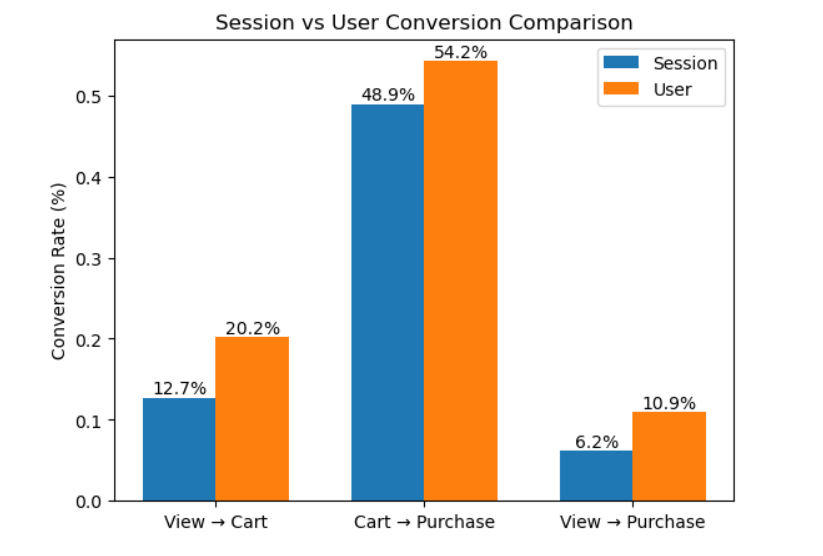
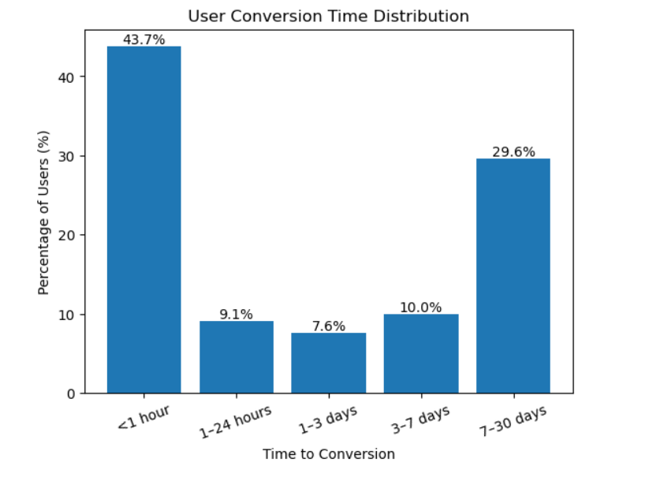
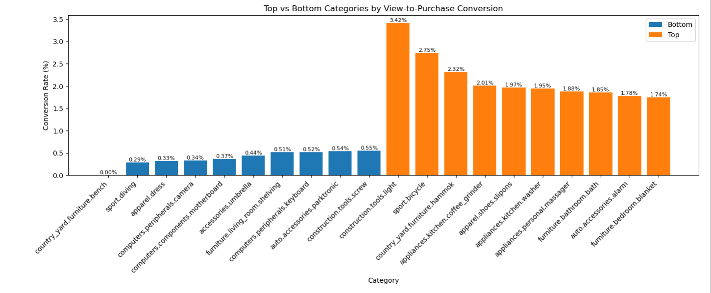
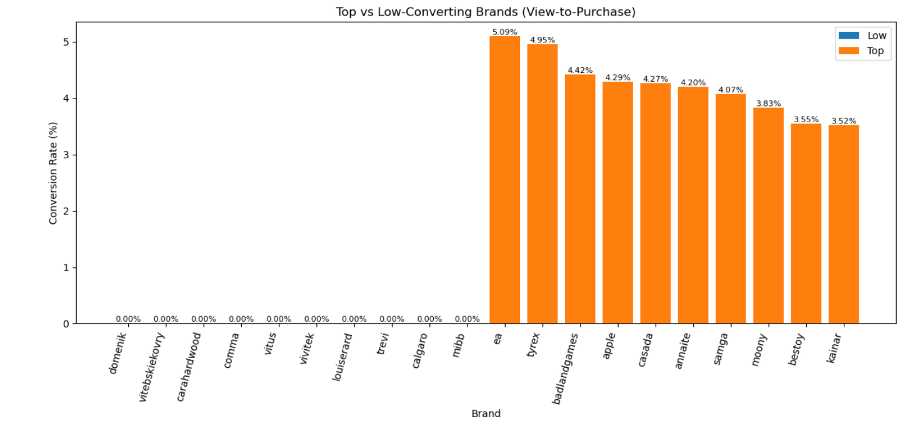
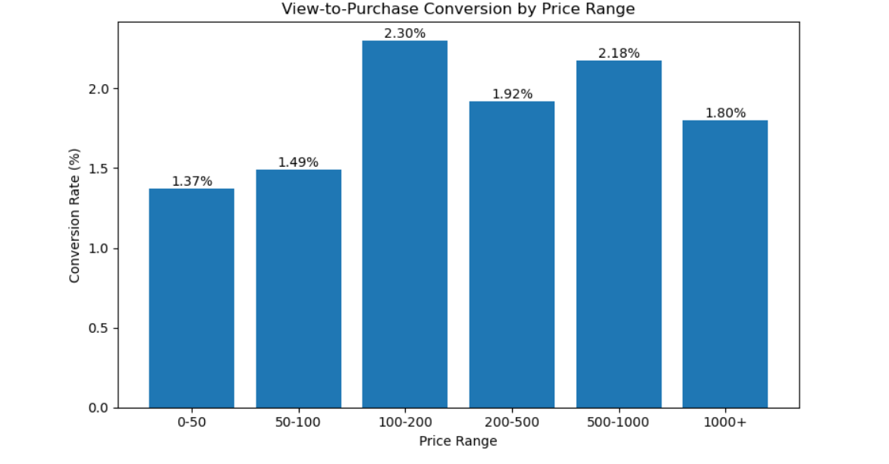

# E-commerce Conversion Funnel Analysis & Optimization

## Overview

Understanding how users move through an e-commerce platform is critical for improving conversion rates and maximizing revenue. While millions of user interactions occur daily, only a small fraction result in completed purchases.

This project analyzes over **67 million user interaction events** from a large multi-category online store to uncover how users progress through the conversion funnel — from product views to purchases — and identify where the most significant drop-offs occur.

By combining session-level and user-level analysis, along with behavioral insights across time, categories, and brands, this project provides a comprehensive view of conversion performance and highlights key opportunities for optimization.

## Executive Summary

- The primary bottleneck occurs at the **view → cart stage**, with approximately **87% of users dropping off** before adding products to the cart.
- Users who reach the cart stage show strong purchase intent, with **~49–54% converting to purchase**.
- Conversion often happens across **multiple sessions**, indicating that users require time and repeated interactions before making a purchase.
- **Mid-priced products (100–200)** achieve the highest conversion rates (~2.3%), outperforming both low- and high-priced items.
- Significant variation exists across **categories and brands**, with low-performing segments failing to convert despite strong traffic.
- The biggest opportunities lie in improving **early-stage engagement, pricing strategy, and brand trust**.

## Dataset

This project utilizes a large-scale e-commerce dataset containing over **67 million user interaction events** from a multi-category online store.

Each record represents a user action within the platform and includes the following key attributes:

- **event_type**: Type of interaction (view, cart, purchase)
- **product_id**: Unique identifier for each product
- **category_code**: Product category hierarchy
- **brand**: Product brand (with missing values handled)
- **price**: Product price
- **user_id**: Unique user identifier
- **user_session**: Session identifier for tracking user behavior within visits
- **event_time**: Timestamp of the interaction

### Key Characteristics

- High-volume dataset (~67M rows) requiring efficient data handling
- Multi-step funnel behavior captured across sessions
- Presence of missing values (e.g., brand, category) addressed during preprocessing
- Suitable for analyzing user behavior, conversion patterns, and product performance

The dataset enables comprehensive analysis across multiple dimensions, including session-level and user-level funnels, time-to-conversion, and segmentation by category, brand, and price.

## Methodology

The analysis follows a structured, multi-step approach to evaluate conversion behavior across the e-commerce funnel and identify performance gaps.

### 1. Data Preparation
- Cleaned missing values in key fields such as brand and category
- Removed invalid or incomplete sessions (e.g., missing session IDs)
- Optimized data handling using efficient storage formats (e.g., Parquet) for scalability

### 2. Funnel Construction
- Defined the conversion funnel as: **View → Cart → Purchase**
- Computed funnel metrics at both:
  - **Session level** (within a single visit)
  - **User level** (across multiple sessions)

### 3. Conversion Metrics
- Calculated key performance indicators:
  - View → Cart conversion rate
  - Cart → Purchase conversion rate
  - Overall View → Purchase conversion rate
- Analyzed drop-offs at each stage of the funnel

### 4. Behavioral Analysis
- Examined **time-to-conversion** to understand user decision cycles
- Identified immediate vs delayed conversion patterns

### 5. Segmentation Analysis
- Evaluated conversion performance across:
  - **Product categories**
  - **Brands** (with filtering to remove low-volume noise)
  - **Price ranges** (using defined price buckets)

### 6. Insight Generation
- Identified key bottlenecks, behavioral patterns, and performance gaps
- Synthesized findings across all dimensions for a holistic view

### 7. Recommendations
- Translated insights into actionable business strategies focused on:
  - Improving early-stage engagement
  - Enhancing trust and product positioning
  - Optimizing pricing and retention strategies

  ## Key Insights & Visualizations

### Funnel Drop-off Across Stages

- A significant drop-off occurs at the **view → cart stage (~87%)**, indicating weak transition from browsing to purchase intent.
- Once users add items to the cart, nearly **half complete the purchase**, showing strong intent at later stages.

---

### Session vs User Conversion Behavior

- Conversion rates are higher at the **user level** compared to session level.
- This indicates that users often require **multiple sessions** before completing a purchase.

---

### Time to Conversion Distribution

- **~43.7% of users convert within 1 hour**, indicating high-intent purchases.
- However, **~29.6% take 7–30 days**, highlighting the importance of retargeting and long-term engagement.

---

### Category-Level Conversion Performance

- Top categories achieve **~1.7%–3.4% conversion**, while bottom categories remain below **~0.6%**.
- The gap is driven primarily by **low view → cart conversion** in underperforming categories.

---

### Brand-Level Conversion Disparity

- High-performing brands convert effectively, while some brands show **near-zero conversion despite significant traffic**.
- Indicates strong influence of **brand trust, positioning, and perceived value**.

---

### Price Sensitivity & Conversion Rates

- Conversion is highest for **mid-priced products (100–200)** at ~2.3%.
- Both low-priced and high-priced products underperform, suggesting challenges in **perceived value and purchase hesitation**.

## Business Recommendations

- **Improve View → Cart Conversion (Primary Bottleneck)**  
  Optimize product pages with clearer pricing, high-quality visuals, and strong call-to-action elements to increase add-to-cart actions.

- **Enhance Brand Trust for Low-Converting Brands**  
  Introduce customer reviews, ratings, and trust signals to improve credibility for brands with high traffic but low conversion.

- **Leverage Retargeting for Delayed Conversions**  
  Implement email reminders, personalized ads, and abandoned cart notifications to capture users with longer decision cycles.

- **Optimize Pricing Strategy**  
  Focus on mid-range pricing (100–200), which shows the highest conversion, and refine pricing for low- and high-priced products to improve perceived value.

- **Improve Engagement in Low-Performing Categories**  
  Reassess product positioning, pricing, and presentation for categories with weak view → cart conversion.

- **Simplify Checkout Experience**  
  Reduce friction in the checkout process through fewer steps, guest checkout, and multiple payment options.

- **Personalize User Experience Across Sessions**  
  Use recommendations, recently viewed items, and session continuity to guide users back into the funnel.

- **Target High-Intent Users**  
  Apply urgency signals (e.g., limited-time offers, low stock alerts) to users who have added items to cart.

  ## Tech Stack

- **Programming Language**: Python  
- **Data Processing**: Pandas, NumPy  
- **Data Visualization**: Matplotlib, Seaborn  
- **Data Storage & Optimization**: Parquet  
- **Environment**: Jupyter Notebook  

## Conclusion

This project highlights key inefficiencies in the e-commerce conversion funnel, with the most significant drop-off occurring at the early **view → cart stage**. While users who reach the cart demonstrate strong purchase intent, overall conversion is limited by weak initial engagement.

The analysis shows that conversion behavior is influenced by multiple factors, including user revisit patterns, product categories, brand trust, and pricing. In particular, mid-priced products perform best, emphasizing the importance of perceived value.

By focusing on early-stage optimization, pricing strategy, and trust-building, businesses can significantly improve conversion rates and drive sustainable revenue growth.